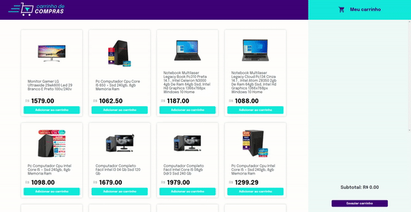

# Shopping Cart

### PT - BR

Nesse projeto, eu fui capaz de:

- Fazer requisições a uma API (Application Programming Interface) do Mercado Livre;
- Utilizar meus conhecimentos sobre JavaScript, CSS e HTML;
- Trabalhar com funções assíncronas;
- Implementar testes unitários.

### EN

In this project, I was able to:

- Make requests to an API (Application Programming Interface) from Mercado Livre;
- Use my knowledge of JavaScript, CSS and HTML;
- Work with asynchronous functions;
- Implement unit tests.

#### Project Link: https://project-shopping-cart-abc2zydvh-mateussousaa.vercel.app/
